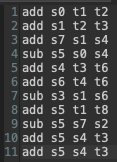
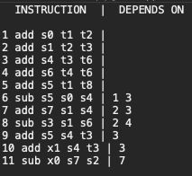

# Ferramento de reordenamento de instruções

Trabalho final da disciplina de Arquitetura de Computadores

#### Autores

1. Maria Rayane Ribeiro da Silva Alves (mrayalves05@gmail.com)
2. Natanael Fernandes Toscano Araújo (fernandesnatanael01@gmail.com)

#### Tecnologias

1. Java

#### Informações gerais

A proposta desse projeto é **implementar uma ferramenta que recebe como entrada a informação sobre a  dependência de dados de todas as instruções (grafo de dependência de dados) e, realiza o reordenamento de instruções para reduzir essas dependências**.

Assim, o projeto recebe um conjunto de instruções em estrutura de registradores. Cada instrução segue a seguinte forma: 

> `add s0 t1 t2`

Nessa instrução, a **primeira string** indica **qual a operação aquela instrução trabalha** (nesse caso, por exemplo, essa instrução fará uma soma). A **segunda string** indica **qual o registrador de destino dessa operação**, ou seja onde o valor da soma será guardado, nesse caso. A **terceira string** indica **qual o registrador contém o primeiro valor a ser operado**, seguido da **quarta string** que **indica qual é o segundo**.

Sabendo disso, o que deve ser feito é indicar a dependência entre as instruções. Essa dependência é definida pela seguinte ideia: *sempre que uma instrução tiver como operadores (tipo t1 e t2 no exemplo acima) registradores que foram usado como destino de uma operação anterior a ela, essa instrução depende que essa anterior finalize para que ela possa ser executada*.
 
Dessa forma, o projeto calcula essas dependência e reorganiza as instruções para que as instruções que dependem de outra fiquem o mais distante possível de tais; dando, assim, tempo para essa primeira operação finalizar antes dela iniciar.

#### Sobre a solução

A solução implementada trabalha com um conceito mais geral de grafos. Nós pensamos, incialmente, em implementar uma árvore, na qual os nós filhos de um nó seriam as instruções que dependem dele. Porém, como uma instrução possui dois registradores, poderia haver dependência de uma instrução com outras duas; assim, o nó teria dois nós como pais, o que foge do conceito de árvore e tende mais ao conceito de grafo. 

Conhecendo isso, existe uma classe chamada *Node* que atua como o nó do grafo. Cada Node possuirá a instrução convertida para a classe *Instruction*. A partir disso, teremos na classe *Graph* um Node raíz (que sempre terá a primeira raíz nula), um inteiro que guarda qual seu nível, uma listas de grafos de dependentes (os nós que dependem dele) e outra lista de responsáveis (os nós que ele depende). Sempre que uma instrução depende de uma outra, o grafo no qual seu nó está armazenado como raíz guardará esse nó do qual ele depende na lista de responsável e o nó responsável o guardará na sua lista de dependente. 

Tendo todo o grafo construído, a reordenação das instruções será feita a partir do percorrimento do grafo por nível, da esquerda para a direita, já que o grafo é construído seguindo a ideia de que o nó dependente sempre estará um nível mais baixo que o último nó que ele depende. Assim, os nós dos mesmos níveis nunca estarão com uma dependência entre si.  

Dessa forma, considerando como entrada as instruções

o programa retorna a saída 

na qual, a esquerda são as instruções reordenadas e a direita de qual linha está a instrução que ela depende.

Vale salientar que implementamos uma solução para evitar falsas dependências entre instruções; seguindo a ideia de que sempre que uma instrução tiver como destino um registrador que as instruções adjacentes também tiverem, esse registrador seria renomeado. Porém, enfrentamos problemas e esse algoritmo ainda não está tão bem implementado. Assim, não nos aprofundaremos muito nessa solução aqui.

#### Executando a solução

Para executar o projeto, primeiramente clone esse repositório em sua máquina.

Posteriormente, abra o repositório no Eclipse, procure a classe *Main* que está no pacote `br.ufrn.imd.instruction.reorder`, clica no botão direito em cima da classe e selecione `Run as > Java Application`. 

Vale lembrar que as instruções de entrada são carregadas do arquivo *instruction.txt* localizado em `br.ufrn.imd.instruction.reorder.files`. Caso deseje mudar as entradas, só precisa alterar nesse arquivo.

